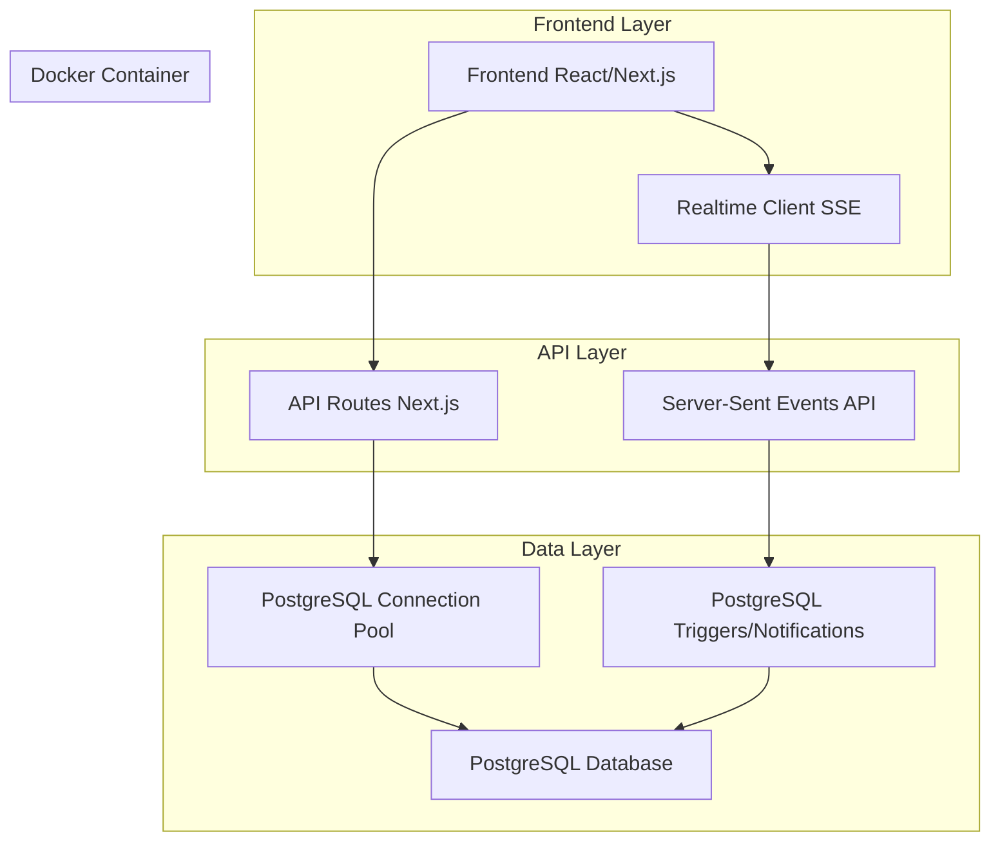
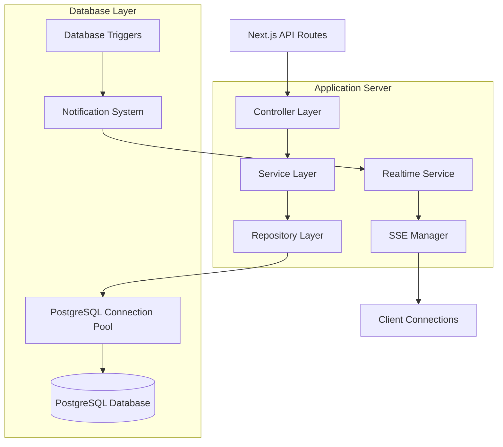
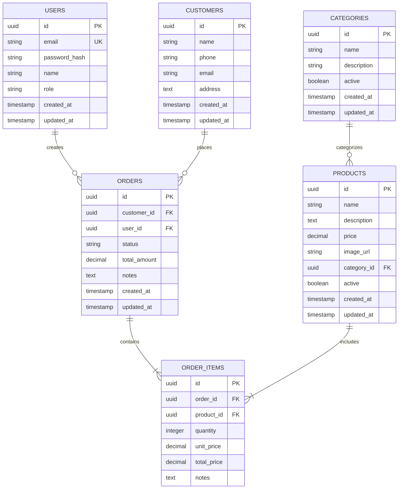

# Arquitetura Técnica - Migração Supabase para PostgreSQL

## 1. Arquitetura de Migração



## 2. Descrição das Tecnologias

- **Frontend**: React@18 + Next.js@14 + TypeScript + TailwindCSS
- **Backend**: Next.js API Routes + Node.js
- **Database**: PostgreSQL@15 (Docker)
- **Connection**: pg (node-postgres) + Connection Pooling
- **Realtime**: Server-Sent Events (SSE)
- **State Management**: React Query + Context API

## 3. Definições de Rotas

| Rota | Propósito |
|------|----------|
| `/api/auth/*` | Autenticação e autorização de usuários |
| `/api/products` | Gestão de produtos do cardápio |
| `/api/orders` | Gestão de pedidos e status |
| `/api/customers` | Gestão de clientes |
| `/api/settings` | Configurações da aplicação |
| `/api/admin/*` | Funcionalidades administrativas |
| `/api/realtime/events` | Server-Sent Events para atualizações em tempo real |
| `/api/notifications/realtime` | Envio de notificações em tempo real |

## 4. Definições de API

### 4.1 APIs Core

#### Autenticação
```
POST /api/auth/login
```

**Request:**
| Param Name | Param Type | isRequired | Description |
|------------|------------|------------|-------------|
| email | string | true | Email do usuário |
| password | string | true | Senha do usuário |

**Response:**
| Param Name | Param Type | Description |
|------------|------------|-------------|
| success | boolean | Status da autenticação |
| user | object | Dados do usuário autenticado |
| token | string | Token de sessão |

**Exemplo:**
```json
{
  "email": "admin@pizzaria.com",
  "password": "senha123"
}
```

#### Gestão de Pedidos
```
GET /api/orders
```

**Response:**
| Param Name | Param Type | Description |
|------------|------------|-------------|
| orders | array | Lista de pedidos |
| total | number | Total de pedidos |
| pagination | object | Informações de paginação |

```
PUT /api/orders/{id}/status
```

**Request:**
| Param Name | Param Type | isRequired | Description |
|------------|------------|------------|-------------|
| status | string | true | Novo status do pedido |
| notes | string | false | Observações sobre a mudança |

#### Realtime Events
```
GET /api/realtime/events
```

**Response:** Server-Sent Events stream
```
data: {"channel":"orders","event":"update","payload":{"id":123,"status":"preparing"}}

data: {"channel":"notifications","event":"new","payload":{"message":"Novo pedido recebido"}}
```

## 5. Arquitetura do Servidor



## 6. Modelo de Dados

### 6.1 Definição do Modelo de Dados



### 6.2 Data Definition Language

#### Tabela de Usuários
```sql
-- Criar tabela de usuários
CREATE TABLE users (
    id UUID PRIMARY KEY DEFAULT gen_random_uuid(),
    email VARCHAR(255) UNIQUE NOT NULL,
    password_hash VARCHAR(255) NOT NULL,
    name VARCHAR(100) NOT NULL,
    role VARCHAR(20) DEFAULT 'user' CHECK (role IN ('admin', 'user', 'manager')),
    created_at TIMESTAMP WITH TIME ZONE DEFAULT NOW(),
    updated_at TIMESTAMP WITH TIME ZONE DEFAULT NOW()
);

-- Índices
CREATE INDEX idx_users_email ON users(email);
CREATE INDEX idx_users_role ON users(role);
```

#### Tabela de Clientes
```sql
-- Criar tabela de clientes
CREATE TABLE customers (
    id UUID PRIMARY KEY DEFAULT gen_random_uuid(),
    name VARCHAR(100) NOT NULL,
    phone VARCHAR(20),
    email VARCHAR(255),
    address TEXT,
    created_at TIMESTAMP WITH TIME ZONE DEFAULT NOW(),
    updated_at TIMESTAMP WITH TIME ZONE DEFAULT NOW()
);

-- Índices
CREATE INDEX idx_customers_phone ON customers(phone);
CREATE INDEX idx_customers_email ON customers(email);
```

#### Tabela de Categorias
```sql
-- Criar tabela de categorias
CREATE TABLE categories (
    id UUID PRIMARY KEY DEFAULT gen_random_uuid(),
    name VARCHAR(100) NOT NULL,
    description TEXT,
    active BOOLEAN DEFAULT true,
    created_at TIMESTAMP WITH TIME ZONE DEFAULT NOW(),
    updated_at TIMESTAMP WITH TIME ZONE DEFAULT NOW()
);

-- Índices
CREATE INDEX idx_categories_active ON categories(active);
```

#### Tabela de Produtos
```sql
-- Criar tabela de produtos
CREATE TABLE products (
    id UUID PRIMARY KEY DEFAULT gen_random_uuid(),
    name VARCHAR(100) NOT NULL,
    description TEXT,
    price DECIMAL(10,2) NOT NULL,
    image_url VARCHAR(500),
    category_id UUID REFERENCES categories(id),
    active BOOLEAN DEFAULT true,
    created_at TIMESTAMP WITH TIME ZONE DEFAULT NOW(),
    updated_at TIMESTAMP WITH TIME ZONE DEFAULT NOW()
);

-- Índices
CREATE INDEX idx_products_category_id ON products(category_id);
CREATE INDEX idx_products_active ON products(active);
CREATE INDEX idx_products_price ON products(price);
```

#### Tabela de Pedidos
```sql
-- Criar tabela de pedidos
CREATE TABLE orders (
    id UUID PRIMARY KEY DEFAULT gen_random_uuid(),
    customer_id UUID REFERENCES customers(id),
    user_id UUID REFERENCES users(id),
    status VARCHAR(20) DEFAULT 'pending' CHECK (status IN ('pending', 'confirmed', 'preparing', 'ready', 'delivered', 'cancelled')),
    total_amount DECIMAL(10,2) NOT NULL,
    notes TEXT,
    created_at TIMESTAMP WITH TIME ZONE DEFAULT NOW(),
    updated_at TIMESTAMP WITH TIME ZONE DEFAULT NOW()
);

-- Índices
CREATE INDEX idx_orders_customer_id ON orders(customer_id);
CREATE INDEX idx_orders_user_id ON orders(user_id);
CREATE INDEX idx_orders_status ON orders(status);
CREATE INDEX idx_orders_created_at ON orders(created_at DESC);
```

#### Tabela de Itens do Pedido
```sql
-- Criar tabela de itens do pedido
CREATE TABLE order_items (
    id UUID PRIMARY KEY DEFAULT gen_random_uuid(),
    order_id UUID REFERENCES orders(id) ON DELETE CASCADE,
    product_id UUID REFERENCES products(id),
    quantity INTEGER NOT NULL CHECK (quantity > 0),
    unit_price DECIMAL(10,2) NOT NULL,
    total_price DECIMAL(10,2) NOT NULL,
    notes TEXT
);

-- Índices
CREATE INDEX idx_order_items_order_id ON order_items(order_id);
CREATE INDEX idx_order_items_product_id ON order_items(product_id);
```

#### Triggers para Realtime
```sql
-- Função para notificações em tempo real
CREATE OR REPLACE FUNCTION notify_order_changes()
RETURNS TRIGGER AS $$
BEGIN
    IF TG_OP = 'INSERT' THEN
        PERFORM pg_notify('order_changes', json_build_object(
            'operation', 'INSERT',
            'record', row_to_json(NEW)
        )::text);
        RETURN NEW;
    ELSIF TG_OP = 'UPDATE' THEN
        PERFORM pg_notify('order_changes', json_build_object(
            'operation', 'UPDATE',
            'record', row_to_json(NEW),
            'old_record', row_to_json(OLD)
        )::text);
        RETURN NEW;
    ELSIF TG_OP = 'DELETE' THEN
        PERFORM pg_notify('order_changes', json_build_object(
            'operation', 'DELETE',
            'record', row_to_json(OLD)
        )::text);
        RETURN OLD;
    END IF;
    RETURN NULL;
END;
$$ LANGUAGE plpgsql;

-- Trigger para mudanças em pedidos
CREATE TRIGGER orders_notify_trigger
    AFTER INSERT OR UPDATE OR DELETE ON orders
    FOR EACH ROW EXECUTE FUNCTION notify_order_changes();
```

#### Dados Iniciais
```sql
-- Inserir usuário administrador padrão
INSERT INTO users (email, password_hash, name, role) VALUES 
('admin@pizzaria.com', '$2b$10$hash_da_senha', 'Administrador', 'admin');

-- Inserir categorias padrão
INSERT INTO categories (name, description) VALUES 
('Pizzas', 'Pizzas tradicionais e especiais'),
('Bebidas', 'Refrigerantes, sucos e águas'),
('Sobremesas', 'Doces e sobremesas');

-- Inserir produtos exemplo
INSERT INTO products (name, description, price, category_id) 
SELECT 
    'Pizza Margherita', 
    'Pizza com molho de tomate, mussarela e manjericão', 
    25.90,
    c.id 
FROM categories c WHERE c.name = 'Pizzas';
```

## 7. Configuração do Ambiente

### 7.1 Docker Compose
O PostgreSQL já está configurado no `docker-compose.yml` existente:

```yaml
version: '3.8'
services:
  postgres:
    image: postgres:15-alpine
    environment:
      POSTGRES_DB: erppizzaria
      POSTGRES_USER: postgres
      POSTGRES_PASSWORD: ${POSTGRES_PASSWORD}
    volumes:
      - postgres_data:/var/lib/postgresql/data
      - ./init-scripts:/docker-entrypoint-initdb.d
    ports:
      - "5432:5432"
```

### 7.2 Variáveis de Ambiente
```env
# Database
POSTGRES_HOST=localhost
POSTGRES_PORT=5432
POSTGRES_DB=erppizzaria
POSTGRES_USER=postgres
POSTGRES_PASSWORD=sua_senha_segura

# Application
NEXT_PUBLIC_API_URL=http://localhost:3000/api
JWT_SECRET=sua_chave_jwt_secreta

# Development
NODE_ENV=development
```

Esta arquitetura garante uma migração completa do Supabase para PostgreSQL self-hosted, mantendo todas as funcionalidades existentes e preparando a aplicação para escalabilidade futura.