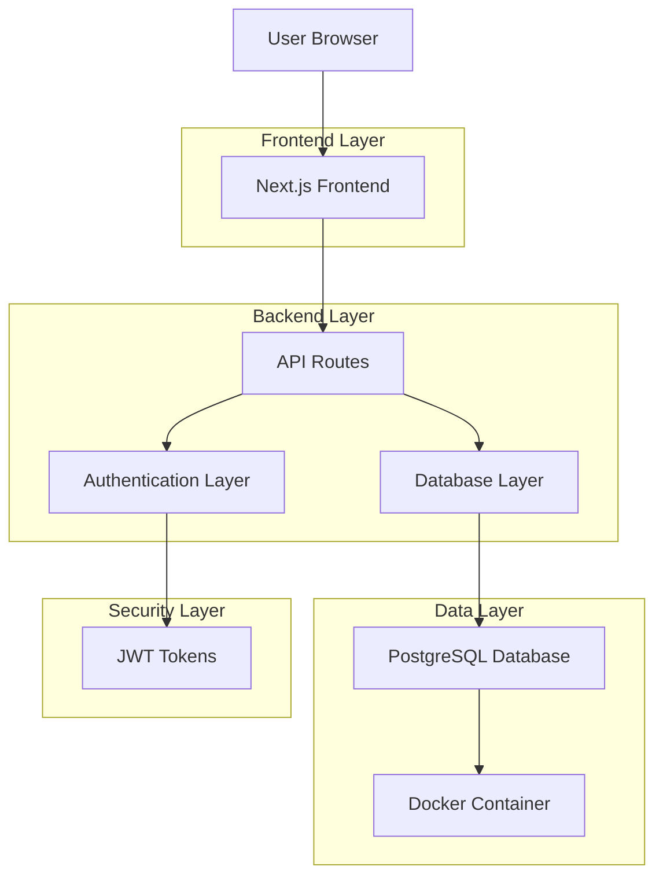
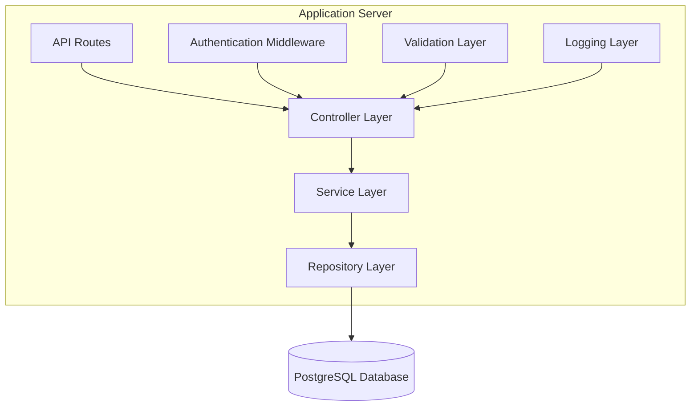
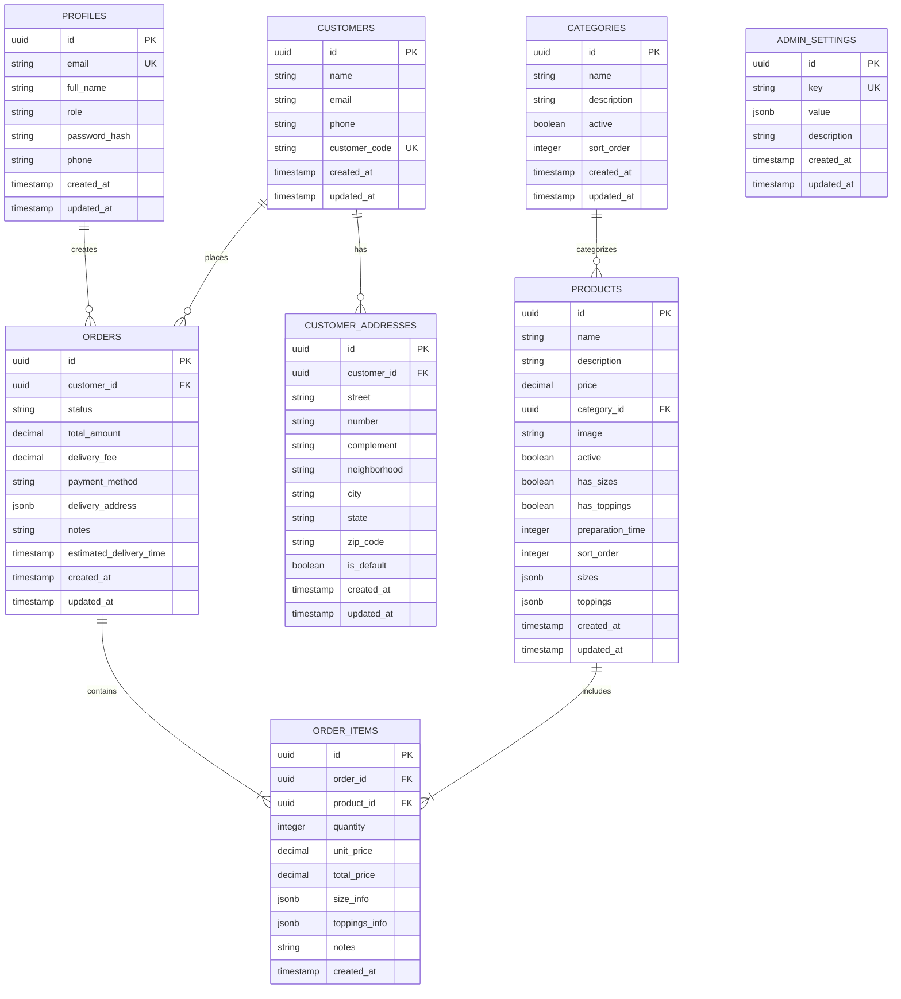

# Arquitetura Técnica: PostgreSQL Self-Hosted

## 1. Visão Geral da Arquitetura

### 1.1 Diagrama de Arquitetura



## 2. Especificações Técnicas

### 2.1 Stack Tecnológico

- **Frontend**: Next.js 14 + React 18 + TypeScript
- **Backend**: Next.js API Routes + Node.js
- **Database**: PostgreSQL 15 (Docker)
- **Authentication**: JWT + bcryptjs
- **Database Client**: node-postgres (pg)
- **Styling**: Tailwind CSS

### 2.2 Dependências Principais

```json
{
  "dependencies": {
    "pg": "^8.11.3",
    "@types/pg": "^8.10.9",
    "bcryptjs": "^2.4.3",
    "@types/bcryptjs": "^2.4.6",
    "jsonwebtoken": "^9.0.2",
    "@types/jsonwebtoken": "^9.0.10"
  }
}
```

## 3. Definições de Rotas

### 3.1 Rotas Frontend

| Rota | Propósito | Autenticação |
|------|-----------|-------------|
| `/` | Página inicial | Pública |
| `/login` | Login de usuários | Pública |
| `/admin/login` | Login administrativo | Pública |
| `/cardapio` | Cardápio de produtos | Autenticada |
| `/admin` | Painel administrativo | Admin |
| `/admin/products` | Gestão de produtos | Admin |
| `/admin/orders` | Gestão de pedidos | Admin |
| `/admin/customers` | Gestão de clientes | Admin |

### 3.2 Rotas da API

| Rota | Método | Propósito | Autenticação |
|------|--------|-----------|-------------|
| `/api/auth/login` | POST | Autenticação de usuários | Pública |
| `/api/auth/logout` | POST | Logout de usuários | Autenticada |
| `/api/auth/refresh` | POST | Renovar tokens | Autenticada |
| `/api/products` | GET/POST | CRUD de produtos | GET: Pública, POST: Admin |
| `/api/products/[id]` | GET/PUT/DELETE | Operações específicas de produto | Admin |
| `/api/orders` | GET/POST | CRUD de pedidos | Autenticada |
| `/api/orders/[id]` | GET/PUT/DELETE | Operações específicas de pedido | Autenticada |
| `/api/customers` | GET/POST | CRUD de clientes | Admin |
| `/api/customers/[id]` | GET/PUT/DELETE | Operações específicas de cliente | Admin |
| `/api/categories` | GET/POST | CRUD de categorias | GET: Pública, POST: Admin |

## 4. Definições de API

### 4.1 Autenticação

#### POST /api/auth/login

**Request:**
```json
{
  "email": "string",
  "password": "string"
}
```

**Response:**
```json
{
  "success": true,
  "user": {
    "id": "uuid",
    "email": "string",
    "full_name": "string",
    "role": "admin|customer|kitchen|delivery"
  }
}
```

#### POST /api/auth/refresh

**Request:**
```json
{
  "refreshToken": "string"
}
```

**Response:**
```json
{
  "accessToken": "string",
  "refreshToken": "string"
}
```

### 4.2 Produtos

#### GET /api/products

**Response:**
```json
[
  {
    "id": "uuid",
    "name": "string",
    "description": "string",
    "price": "number",
    "category_id": "uuid",
    "image": "string|null",
    "active": "boolean",
    "has_sizes": "boolean",
    "has_toppings": "boolean",
    "preparation_time": "number",
    "created_at": "string",
    "updated_at": "string"
  }
]
```

#### POST /api/products

**Request:**
```json
{
  "name": "string",
  "description": "string",
  "price": "number",
  "category_id": "uuid",
  "image": "string|null",
  "active": "boolean",
  "sizes": "array",
  "toppings": "array"
}
```

### 4.3 Pedidos

#### POST /api/orders

**Request:**
```json
{
  "customer_id": "uuid",
  "items": [
    {
      "product_id": "uuid",
      "quantity": "number",
      "unit_price": "number",
      "size_info": "object|null",
      "toppings_info": "array|null",
      "notes": "string|null"
    }
  ],
  "delivery_address": "object",
  "payment_method": "string",
  "notes": "string|null"
}
```

## 5. Arquitetura do Servidor

### 5.1 Diagrama de Camadas



### 5.2 Estrutura de Pastas

```
lib/
├── database.ts          # Cliente PostgreSQL
├── auth.ts             # Sistema de autenticação
├── validation.ts       # Schemas de validação
├── logging.ts          # Sistema de logs
└── db/
    ├── users.ts        # Operações de usuários
    ├── products.ts     # Operações de produtos
    ├── orders.ts       # Operações de pedidos
    ├── customers.ts    # Operações de clientes
    └── categories.ts   # Operações de categorias
```

## 6. Modelo de Dados

### 6.1 Diagrama ER



### 6.2 DDL (Data Definition Language)

#### Tabela de Perfis
```sql
CREATE TABLE profiles (
    id UUID PRIMARY KEY DEFAULT uuid_generate_v4(),
    email VARCHAR(255) UNIQUE NOT NULL,
    full_name VARCHAR(255) NOT NULL,
    role VARCHAR(50) DEFAULT 'customer' CHECK (role IN ('customer', 'admin', 'kitchen', 'delivery')),
    password_hash VARCHAR(255) NOT NULL,
    phone VARCHAR(20),
    created_at TIMESTAMP WITH TIME ZONE DEFAULT NOW(),
    updated_at TIMESTAMP WITH TIME ZONE DEFAULT NOW()
);

CREATE INDEX idx_profiles_email ON profiles(email);
CREATE INDEX idx_profiles_role ON profiles(role);
```

#### Tabela de Produtos
```sql
CREATE TABLE products (
    id UUID PRIMARY KEY DEFAULT uuid_generate_v4(),
    name VARCHAR(255) NOT NULL,
    description TEXT,
    price DECIMAL(10,2) NOT NULL,
    category_id UUID REFERENCES categories(id),
    image VARCHAR(500),
    active BOOLEAN DEFAULT true,
    has_sizes BOOLEAN DEFAULT false,
    has_toppings BOOLEAN DEFAULT false,
    preparation_time INTEGER DEFAULT 30,
    sort_order INTEGER,
    sizes JSONB,
    toppings JSONB,
    created_at TIMESTAMP WITH TIME ZONE DEFAULT NOW(),
    updated_at TIMESTAMP WITH TIME ZONE DEFAULT NOW()
);

CREATE INDEX idx_products_category_id ON products(category_id);
CREATE INDEX idx_products_active ON products(active);
CREATE INDEX idx_products_name ON products(name);
```

#### Tabela de Pedidos
```sql
CREATE TABLE orders (
    id UUID PRIMARY KEY DEFAULT uuid_generate_v4(),
    customer_id UUID REFERENCES customers(id),
    status VARCHAR(50) DEFAULT 'pending' CHECK (status IN ('pending', 'confirmed', 'preparing', 'ready', 'delivered', 'cancelled')),
    total_amount DECIMAL(10,2) NOT NULL,
    delivery_fee DECIMAL(10,2) DEFAULT 0,
    payment_method VARCHAR(50),
    delivery_address JSONB,
    notes TEXT,
    estimated_delivery_time TIMESTAMP WITH TIME ZONE,
    created_at TIMESTAMP WITH TIME ZONE DEFAULT NOW(),
    updated_at TIMESTAMP WITH TIME ZONE DEFAULT NOW()
);

CREATE INDEX idx_orders_customer_id ON orders(customer_id);
CREATE INDEX idx_orders_status ON orders(status);
CREATE INDEX idx_orders_created_at ON orders(created_at DESC);
```

## 7. Configuração de Segurança

### 7.1 Autenticação JWT

```typescript
// Configuração de tokens
const JWT_CONFIG = {
  accessToken: {
    secret: process.env.JWT_SECRET,
    expiresIn: '15m'
  },
  refreshToken: {
    secret: process.env.REFRESH_TOKEN_SECRET,
    expiresIn: '7d'
  }
}
```

### 7.2 Hashing de Senhas

```typescript
// Configuração bcrypt
const BCRYPT_ROUNDS = 12

// Hash de senha
const hashedPassword = await bcrypt.hash(password, BCRYPT_ROUNDS)

// Verificação de senha
const isValid = await bcrypt.compare(password, hashedPassword)
```

### 7.3 Configuração do Pool de Conexões

```typescript
const pool = new Pool({
  host: process.env.DB_HOST,
  port: parseInt(process.env.DB_PORT || '5432'),
  database: process.env.DB_NAME,
  user: process.env.DB_USER,
  password: process.env.DB_PASSWORD,
  max: 20,                    // máximo de conexões
  idleTimeoutMillis: 30000,   // timeout de conexão idle
  connectionTimeoutMillis: 2000, // timeout de conexão
  ssl: process.env.NODE_ENV === 'production' ? { rejectUnauthorized: false } : false
})
```

## 8. Configuração do Docker

### 8.1 Docker Compose

```yaml
version: '3.8'
services:
  postgres:
    image: postgres:15-alpine
    container_name: erppizzaria_db
    environment:
      POSTGRES_DB: erppizzaria
      POSTGRES_USER: postgres
      POSTGRES_PASSWORD: ${DB_PASSWORD}
      POSTGRES_INITDB_ARGS: "--encoding=UTF8 --locale=C"
    ports:
      - "5432:5432"
    volumes:
      - postgres_data:/var/lib/postgresql/data
      - ./init.sql:/docker-entrypoint-initdb.d/01-init.sql
      - ./seed.sql:/docker-entrypoint-initdb.d/02-seed.sql
    restart: unless-stopped
    healthcheck:
      test: ["CMD-SHELL", "pg_isready -U postgres"]
      interval: 30s
      timeout: 10s
      retries: 3

  pgadmin:
    image: dpage/pgadmin4:latest
    container_name: erppizzaria_pgadmin
    environment:
      PGADMIN_DEFAULT_EMAIL: admin@erppizzaria.com
      PGADMIN_DEFAULT_PASSWORD: admin123
    ports:
      - "8080:80"
    depends_on:
      - postgres
    restart: unless-stopped

volumes:
  postgres_data:
```

### 8.2 Comandos Docker

```bash
# Iniciar serviços
docker-compose up -d

# Parar serviços
docker-compose down

# Logs do PostgreSQL
docker-compose logs postgres

# Backup do banco
docker exec erppizzaria_db pg_dump -U postgres erppizzaria > backup.sql

# Restaurar backup
docker exec -i erppizzaria_db psql -U postgres erppizzaria < backup.sql
```

## 9. Monitoramento e Logs

### 9.1 Sistema de Logs

```typescript
// Configuração de logging
const logger = {
  info: (message: string, meta?: any) => {
    console.log(JSON.stringify({
      level: 'info',
      message,
      timestamp: new Date().toISOString(),
      ...meta
    }))
  },
  error: (message: string, error?: Error, meta?: any) => {
    console.error(JSON.stringify({
      level: 'error',
      message,
      error: error?.message,
      stack: error?.stack,
      timestamp: new Date().toISOString(),
      ...meta
    }))
  }
}
```

### 9.2 Métricas de Performance

```typescript
// Middleware de métricas
export function withMetrics(handler: Function) {
  return async (req: NextRequest, ...args: any[]) => {
    const start = Date.now()
    
    try {
      const result = await handler(req, ...args)
      const duration = Date.now() - start
      
      logger.info('API Request', {
        method: req.method,
        url: req.url,
        duration,
        status: 'success'
      })
      
      return result
    } catch (error) {
      const duration = Date.now() - start
      
      logger.error('API Request Failed', error as Error, {
        method: req.method,
        url: req.url,
        duration,
        status: 'error'
      })
      
      throw error
    }
  }
}
```

## 10. Otimização de Performance

### 10.1 Índices de Banco

```sql
-- Índices para consultas frequentes
CREATE INDEX CONCURRENTLY idx_products_active_category ON products(active, category_id) WHERE active = true;
CREATE INDEX CONCURRENTLY idx_orders_status_created ON orders(status, created_at DESC);
CREATE INDEX CONCURRENTLY idx_order_items_order_product ON order_items(order_id, product_id);

-- Índices para busca de texto
CREATE INDEX CONCURRENTLY idx_products_name_gin ON products USING gin(to_tsvector('portuguese', name));
CREATE INDEX CONCURRENTLY idx_customers_name_gin ON customers USING gin(to_tsvector('portuguese', name));
```

### 10.2 Cache de Consultas

```typescript
// Cache simples em memória
const cache = new Map()
const CACHE_TTL = 5 * 60 * 1000 // 5 minutos

export function withCache(key: string, ttl: number = CACHE_TTL) {
  return function(target: any, propertyName: string, descriptor: PropertyDescriptor) {
    const method = descriptor.value
    
    descriptor.value = async function(...args: any[]) {
      const cacheKey = `${key}:${JSON.stringify(args)}`
      const cached = cache.get(cacheKey)
      
      if (cached && Date.now() - cached.timestamp < ttl) {
        return cached.data
      }
      
      const result = await method.apply(this, args)
      cache.set(cacheKey, { data: result, timestamp: Date.now() })
      
      return result
    }
  }
}
```

---

**Documento gerado em**: 2025-01-16  
**Versão**: 1.0  
**Status**: Arquitetura definida