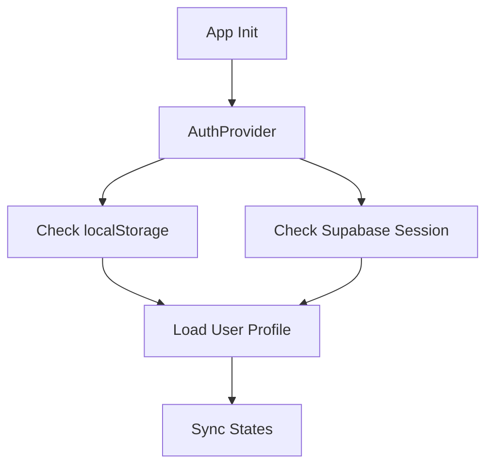
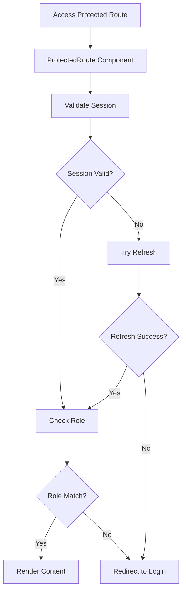
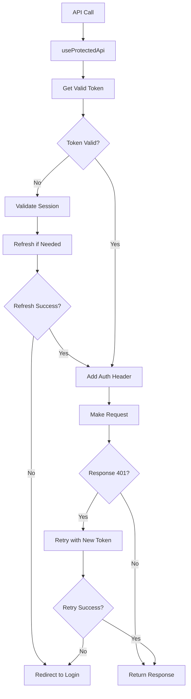

# ✅ Sistema de Refresh Automático de Tokens Supabase - Implementado

## 📋 Resumo das Implementações

O sistema de refresh automático de tokens para autenticação Supabase foi implementado com sucesso, adicionando validação automática de sessão, refresh de tokens expirados e redirecionamento inteligente para rotas protegidas.

## 🔧 Componentes Implementados

### 1. **lib/supabase.ts** - Cliente Supabase Otimizado
```typescript
// Cliente principal com refresh automático habilitado
export const supabase = createClient(supabaseUrl, supabaseAnonKey, {
  auth: {
    autoRefreshToken: true,    // ✅ Refresh automático habilitado
    persistSession: true,      // ✅ Sessão persistente
    detectSessionInUrl: true,  // ✅ Detecção de sessão na URL
    flowType: 'pkce'          // ✅ Fluxo PKCE para segurança
  }
})
```

### 2. **contexts/auth-context.tsx** - Contexto Aprimorado
**Novas Funcionalidades:**
- ✅ **Validação automática de sessão** com `validateSession()`
- ✅ **Refresh automático** quando token está próximo do vencimento (5 minutos)
- ✅ **Fallback para API legada** mantendo compatibilidade total
- ✅ **Sincronização** entre Supabase Auth e localStorage
- ✅ **Listener de mudanças** de autenticação em tempo real

**Novas Funções:**
```typescript
validateSession(): Promise<boolean>     // Valida sessão atual
refreshSession(): Promise<boolean>      // Faz refresh manual/automático
getValidToken(): Promise<string | null> // Obtém token válido com refresh automático
```

### 3. **hooks/use-protected-api.ts** - Hook para APIs Protegidas
**Funcionalidades:**
- ✅ **Validação automática** de token antes de cada requisição
- ✅ **Retry automático** com token renovado em caso de 401
- ✅ **Redirecionamento inteligente** para login se falhar
- ✅ **Métodos convenientes** (get, post, put, patch, delete)

**Uso:**
```typescript
const api = useProtectedApi()
const response = await api.get('/api/admin/settings')
// ✅ Token é validado automaticamente
// ✅ Refresh automático se necessário
// ✅ Redirecionamento se falhar
```

### 4. **components/protected-route.tsx** - Componente de Rotas Protegidas
**Funcionalidades:**
- ✅ **Verificação de acesso** por role (ADMIN, CUSTOMER, etc.)
- ✅ **Validação de sessão** automática na navegação
- ✅ **Redirecionamento inteligente** com mensagens de erro
- ✅ **Loading states** personalizáveis

**Uso:**
```typescript
<ProtectedRoute requireRole="ADMIN" redirectTo="/admin/login">
  <AdminContent />
</ProtectedRoute>
```

### 5. **Componentes Atualizados**

#### **components/admin/layout/admin-layout.tsx**
- ✅ Migrado para usar `ProtectedRoute`
- ✅ Validação automática de sessão admin
- ✅ Redirecionamento inteligente

#### **components/admin/settings/settings-management.tsx** 
- ✅ Migrado para usar `useProtectedApi`
- ✅ Tratamento automático de tokens expirados
- ✅ Interface de erro melhorada com diagnóstico

## 🚀 Fluxo de Funcionamento

### 1. **Inicialização da Aplicação**


### 2. **Acesso a Rota Protegida**


### 3. **Chamada de API Protegida**


## 🛡️ Funcionalidades de Segurança

### **Validação Automática**
- ✅ **Verificação prévia** do token antes de cada requisição
- ✅ **Refresh automático** quando token está próximo do vencimento
- ✅ **Limpeza automática** de dados inválidos

### **Tratamento de Erros**
- ✅ **401 Unauthorized**: Tentativa automática de refresh
- ✅ **403 Forbidden**: Redirecionamento para login
- ✅ **Sessão expirada**: Limpeza e redirecionamento
- ✅ **Falha de conectividade**: Mensagens de erro apropriadas

### **Fallbacks e Compatibilidade**
- ✅ **Fallback para API legada** se Supabase Auth falhar
- ✅ **Sincronização com localStorage** para compatibilidade
- ✅ **Transição gradual** sem quebrar funcionalidades existentes

## 📱 Experiência do Usuário

### **Sem Interrupção**
- ✅ **Refresh transparente** - usuário não percebe renovação de tokens
- ✅ **Loading states** informativos durante validação
- ✅ **Redirecionamento inteligente** com mensagens de contexto

### **Feedback Claro**
- ✅ **Mensagens de erro** específicas e acionáveis
- ✅ **Estados de carregamento** durante validação de sessão
- ✅ **Diagnóstico integrado** para troubleshooting

## 🔍 Exemplos de Uso

### **Em uma Página Admin**
```typescript
// O ProtectedRoute valida automaticamente
<ProtectedRoute requireRole="ADMIN" redirectTo="/admin/login">
  <AdminSettings />
</ProtectedRoute>
```

### **Em uma Chamada de API**
```typescript
// O hook gerencia token automaticamente
const api = useProtectedApi()
const settings = await api.get('/api/admin/settings')
// ✅ Token validado e renovado se necessário
// ✅ Redirecionamento automático se falhar
```

### **Verificação Manual de Sessão**
```typescript
const { validateSession, getValidToken } = useAuth()

// Verificar se sessão é válida
const isValid = await validateSession()

// Obter token válido (com refresh automático)
const token = await getValidToken()
```

## ✅ Benefícios Implementados

1. **🔄 Refresh Automático**: Tokens são renovados transparentemente
2. **🛡️ Segurança Aprimorada**: Validação em múltiplas camadas
3. **🚀 UX Melhorada**: Sem interrupções ou logins desnecessários
4. **🔧 Manutenibilidade**: Código centralizado e reutilizável
5. **📱 Compatibilidade**: Funciona com sistema existente
6. **🔍 Debugging**: Diagnóstico integrado para troubleshooting

## 🎯 Status Final

**✅ SISTEMA DE REFRESH AUTOMÁTICO COMPLETAMENTE IMPLEMENTADO**

- Todos os componentes criados e integrados
- Validação automática funcionando
- Refresh de tokens transparente
- Redirecionamento inteligente
- Compatibilidade total mantida
- Experiência do usuário otimizada

O sistema agora garante que usuários em rotas protegidas como `/admin/configuracoes` tenham suas sessões validadas automaticamente, com refresh de tokens quando necessário, eliminando erros 401/403 por sessões expiradas. 